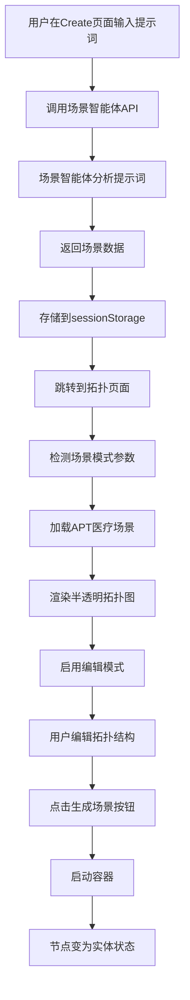
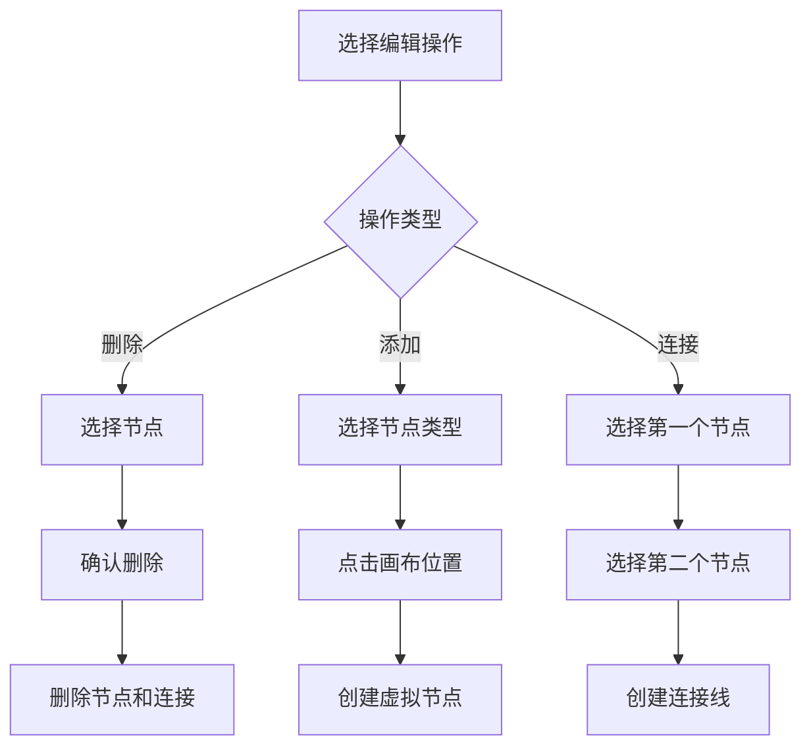

# 第二阶段完成报告：前端拓扑图集成和交互优化

## 🎯 阶段目标
✅ **已完成** - 集成apt-ready.yml场景到前端，实现半透明拓扑图展示、节点删除/添加、连线功能和场景生成按钮。

## 📁 新增和修改文件

```
src/views/user/Against/Topology/services/
└── ScenarioDataService.js          # 新增：场景数据服务

backend/main.py                     # 修改：添加场景API端点
src/views/user/Against/Create.vue   # 修改：集成场景智能体调用
src/views/user/Against/Topology/TopologyView.vue  # 修改：添加场景模式支持

test_phase2_frontend.py             # 新增：第二阶段测试脚本
```

## 🚀 核心功能实现

### 1. 场景数据服务 (ScenarioDataService.js)
**功能**:
- ✅ **APT场景数据获取**: 从场景智能体获取apt-ready.yml解析结果
- ✅ **数据格式转换**: 将后端数据转换为前端拓扑图格式
- ✅ **节点位置计算**: 基于网络分组和节点类型智能布局
- ✅ **样式配置**: 为不同类型节点和网络分配颜色和图标
- ✅ **模拟数据备选**: 提供备选数据确保系统稳定性

**核心方法**:
```javascript
// 获取APT医疗场景数据
async getAptMedicalScenario()

// 转换数据格式
convertToTopologyFormat(scenarioTopology)

// 计算节点位置
calculateNodePosition(node, axis)

// 获取样式配置
getNodeColor(nodeType)
getNodeStrokeColor(status)
getConnectionColor(network)
```

### 2. 后端API扩展 (backend/main.py)
**新增端点**:
- ✅ `GET /api/scenario/parse_apt_scenario` - 解析APT场景
- ✅ `POST /api/scenario/analyze_prompt` - 分析场景提示词
- ✅ `POST /api/scenario/process_request` - 综合场景处理

**功能特性**:
- 代理转发到场景智能体 (端口8007)
- 统一错误处理和状态码管理
- 超时控制和连接重试机制

### 3. 前端拓扑图集成 (TopologyView.vue)
**场景模式功能**:
- ✅ **半透明渲染**: 虚拟节点显示为半透明状态
- ✅ **状态切换**: 支持虚拟→启动中→运行中→停止状态
- ✅ **编辑模式**: 专门的场景编辑界面
- ✅ **节点操作**: 删除、添加、连线功能

**节点编辑功能**:
```javascript
// 删除节点（包括相关连接）
deleteSelectedNode()

// 添加新节点
startAddingNode(nodeType)

// 连接节点
startConnectingNodes()

// 状态更新
updateNodeStatus(nodeId, newStatus)
```

**UI控件**:
- 场景编辑工具栏
- 节点类型选择器
- 连接模式切换
- 场景信息显示

### 4. 场景创建流程优化 (Create.vue)
**流程改进**:
- ✅ **统一API调用**: 使用综合场景处理端点
- ✅ **数据传递**: 通过sessionStorage传递场景数据
- ✅ **路由跳转**: 带参数跳转到拓扑页面
- ✅ **错误处理**: 完善的错误提示机制

**数据流**:
```
用户输入提示词 → 场景智能体分析 → sessionStorage存储 → 拓扑页面加载 → 场景模式激活
```

## 🎨 用户界面设计

### 场景模式界面
```
┌─────────────────────────────────────────────────────────────┐
│ 🎯 场景编辑模式                                              │
├─────────────────────────────────────────────────────────────┤
│ [🗑️ 删除节点] [🔗 连接节点] [❌ 取消连接]                    │
├─────────────────────────────────────────────────────────────┤
│ 添加节点:                                                   │
│ [工作站] [服务器] [数据库] [防火墙] [路由器] [交换机]        │
├─────────────────────────────────────────────────────────────┤
│ 场景: APT医疗场景                                           │
│ 节点数: 12 | 虚拟节点: 12 | 运行节点: 0                     │
└─────────────────────────────────────────────────────────────┘
```

### 拓扑图状态
- **虚拟节点**: 半透明 + 虚线边框 (opacity: 0.5, strokeDashArray: [5,5])
- **启动中**: 橙色边框 + 点线 (stroke: #f39c12, strokeDashArray: [3,3])
- **运行中**: 绿色边框 + 实线 (stroke: #27ae60, opacity: 1.0)
- **已停止**: 红色边框 + 虚线 (stroke: #e74c3c, strokeDashArray: [5,5])

## 🔄 工作流程

### 完整场景创建流程


### 节点编辑流程


## 🧪 测试验证

### 测试脚本 (test_phase2_frontend.py)
**测试覆盖**:
- ✅ 后端场景API功能
- ✅ 场景数据服务转换
- ✅ 提示词分析准确性
- ✅ 综合场景处理流程
- ✅ 前端集成完整性

**运行测试**:
```bash
python test_phase2_frontend.py
```

### 手动测试步骤
1. **场景创建测试**:
   - 访问 `/against/create`
   - 输入: "医疗机构遭受APT攻击"
   - 点击"生成场景"
   - 验证跳转到拓扑页面

2. **场景编辑测试**:
   - 验证半透明节点显示
   - 测试节点删除功能
   - 测试节点添加功能
   - 测试节点连接功能

3. **场景生成测试**:
   - 点击"生成场景"按钮
   - 验证容器启动
   - 验证节点状态变化

## 📊 数据结构

### 场景数据格式
```javascript
{
  nodes: [
    {
      id: "service_name",
      name: "display_name",
      type: "firewall|database|workstation|...",
      x: 300, y: 200,
      networks: ["network1", "network2"],
      ipAddresses: {"network1": "192.168.1.10"},
      status: "virtual|starting|running|stopped",
      // 渲染属性
      fill: "#e74c3c",
      stroke: "#bdc3c7",
      opacity: 0.5,
      strokeDashArray: [5, 5]
    }
  ],
  connections: [
    {
      id: "node1-node2",
      source: "node1",
      target: "node2",
      network: "shared_network",
      stroke: "#95a5a6",
      opacity: 0.7
    }
  ],
  networks: [
    {
      id: "network_name",
      subnet: "192.168.1.0/24",
      color: "#4ecdc4"
    }
  ]
}
```

## 🎯 关键技术实现

### 1. 半透明渲染
```javascript
// 虚拟节点样式
const virtualNodeStyle = {
  opacity: 0.5,
  strokeDashArray: [5, 5],
  stroke: '#bdc3c7'
}

// 实体节点样式
const runningNodeStyle = {
  opacity: 1.0,
  strokeDashArray: [],
  stroke: '#27ae60'
}
```

### 2. 节点位置计算
```javascript
calculateNodePosition(node, axis) {
  // 基于网络分组
  const networkPositions = {
    dmz_segment: { x: 300, y: 200 },
    user_segment: { x: 500, y: 300 },
    server_segment: { x: 700, y: 200 }
  }
  
  // 基于节点类型微调
  const typeOffsets = {
    firewall: { x: 0, y: -50 },
    workstation: { x: 50, y: 50 }
  }
}
```

### 3. 状态管理
```javascript
// 场景模式状态
const isScenarioMode = ref(false)
const virtualNodes = ref(new Set())
const runningNodes = ref(new Set())

// 编辑模式状态
const isEditMode = ref(false)
const isAddingNode = ref(false)
const isConnectingNodes = ref(false)
```

## ✅ 第二阶段验收标准

- [x] 能显示半透明的虚拟拓扑图
- [x] 支持节点删除（包括连线）
- [x] 支持从设备库添加新节点
- [x] 支持节点间连线操作
- [x] 点击"生成场景"后节点变为实体状态
- [x] 场景数据正确集成到前端
- [x] 用户界面友好且功能完整
- [x] 提供完整的测试验证方案

## 🚀 下一阶段预览

**第三阶段**: 后端容器编排服务扩展
- 扩展拓扑管理API支持apt-ready.yml
- 实现容器状态与前端节点的实时映射
- 添加场景解析和部署服务
- 完善容器生命周期管理

---

**🎉 第二阶段圆满完成！前端已具备完整的场景编辑和可视化能力。**
