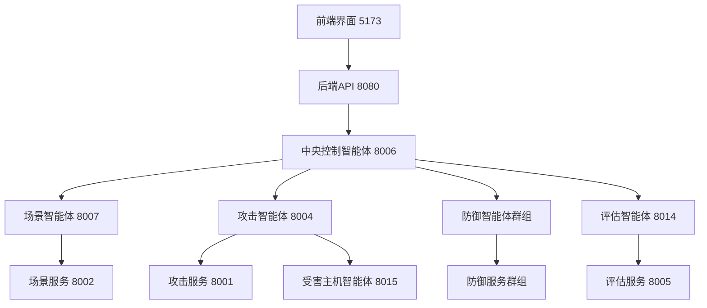

# AI Agent 驱动的动态攻防推演靶场平台 - 部署手册

## 📋 项目概述

本项目是一个基于AI Agent的动态攻防推演靶场平台，实现了动态场景生成、智能攻击模拟、自适应防御决策和演练评估自动化等核心功能。

### 🏗️ 系统架构

#### 核心组件
- **前端界面**: Vue.js 3 + Vite + TailwindCSS + DaisyUI (端口: 5173)
- **后端API**: Python FastAPI (端口: 8080)
- **智能代理层**: 6个专业AI Agent
- **微服务层**: 7个专业MCP服务
- **容器化靶场**: Docker + Docker Compose
- **AI模型**: 基于DeepSeek API

#### 智能代理架构
```
┌─────────────────────────────────────────────────────────┐
│                   AI Agent 智能代理层                    │
├─────────────────────────────────────────────────────────┤
│ 🎯 场景智能体 (8007)  │ ⚔️ 攻击智能体 (8004)           │
│ 🛡️ 防御智能体群组     │ 🎮 中央控制智能体 (8006)       │
│ 📊 评估智能体 (8014)  │ 🖥️ 受害主机智能体 (8015)       │
└─────────────────────────────────────────────────────────┘
```

#### 微服务架构
```
┌─────────────────────────────────────────────────────────┐
│                   MCP 微服务层                          │
├─────────────────────────────────────────────────────────┤
│ 🎯 场景服务 (8002)    │ ⚔️ 攻击服务 (8001)             │
│ 🛡️ 防御服务群组       │ 📊 评估服务 (8005)             │
│ 🔍 溯源服务 (8010)    │ 🚫 威胁阻断服务 (8008)         │
│ 🔧 漏洞修复服务 (8009) │                               │
└─────────────────────────────────────────────────────────┘
```

## 🔧 环境要求

### 硬件要求
- **CPU**: 8核心以上 (推荐16核心)
- **内存**: 16GB以上 (推荐32GB)
- **存储**: 100GB以上可用空间
- **网络**: 稳定的互联网连接 (用于AI API调用)

### 软件要求
- **操作系统**: Windows 10/11, macOS 10.15+, Ubuntu 18.04+
- **Docker**: 20.10+
- **Docker Compose**: 2.0+
- **Node.js**: 18.0+ (推荐LTS版本)
- **Python**: 3.9+
- **Git**: 2.30+

## 🌐 完整服务端口映射

### 前端和后端服务
| 服务名称 | 端口 | 协议 | 说明 |
|----------|------|------|------|
| 前端开发服务器 | 5173 | HTTP | Vue.js开发服务器 |
| 后端API网关 | 8080 | HTTP/WS | FastAPI后端服务 |

### AI智能代理服务
| 智能代理 | 端口 | 协议 | 功能说明 |
|----------|------|------|----------|
| 场景智能体 | 8007 | HTTP | 动态场景生成和管理 |
| 攻击智能体 | 8004 | HTTP | 智能攻击模拟和执行 |
| 中央控制智能体 | 8006 | HTTP/WS | 攻防演练协调控制 |
| 评估智能体 | 8014 | HTTP | 演练效果评估分析 |
| 受害主机智能体 | 8015 | HTTP | 受害者行为模拟 |

### 防御智能体群组
| 防御智能体 | 端口 | 协议 | 功能说明 |
|------------|------|------|----------|
| 威胁阻断智能体 | 8011 | HTTP | 实时威胁检测和阻断 |
| 漏洞修复智能体 | 8012 | HTTP | 自动漏洞扫描和修复 |
| 攻击溯源智能体 | 8013 | HTTP | 攻击路径追踪分析 |

### MCP微服务层
| 微服务 | 端口 | 协议 | 功能说明 |
|--------|------|------|----------|
| 场景服务 | 8002 | HTTP | 场景模板和容器管理 |
| 攻击服务 | 8001 | HTTP | 攻击工具和技术库 |
| 评估服务 | 8005 | HTTP | 评估模型和报告生成 |
| 威胁阻断服务 | 8008 | HTTP | 威胁检测和防护工具 |
| 漏洞修复服务 | 8009 | HTTP | 漏洞扫描和修复工具 |
| 攻击溯源服务 | 8010 | HTTP | 数字取证和溯源分析 |

## 🚀 一键部署方案

### 方式一：智能部署脚本 (推荐)

#### Windows用户
```batch
# 进入部署手册目录
cd 部署手册

# 运行Windows部署脚本
deploy.bat
```

#### Linux/macOS用户
```bash
# 进入部署手册目录
cd 部署手册

# 给脚本执行权限
chmod +x deploy.sh

# 运行部署脚本
./deploy.sh
```

#### Python跨平台脚本
```bash
# 进入部署手册目录
cd 部署手册

# 运行Python部署脚本
python deploy.py
```

### 方式二：分步骤部署

#### 第1步：环境准备
```bash
# 检查Docker状态
docker --version
docker-compose --version

# 检查Node.js和Python
node --version
python --version
```

#### 第2步：安装依赖
```bash
# 安装前端依赖
npm install

# 安装Python依赖
pip install -r requirements.txt
cd backend && pip install -r requirements.txt
```

#### 第3步：配置环境
创建 `agents/scenario_agent/.env` 文件：
```env
DEEPSEEK_API_KEY=sk-xxxxxxxxxxxxxxxxxxxxxxxxxxxxxxxx
DEEPSEEK_BASE_URL=https://api.deepseek.com
MODEL_NAME=deepseek-chat
```

#### 第4步：启动所有服务
```bash
# 使用统一启动脚本
python start_all_services.py

# 或手动启动各个服务
python start_battle_system.py
```

## 📊 服务启动顺序和依赖关系

### 启动顺序
```
1. 基础服务层 (MCP Services)
   ├── 场景服务 (8002)
   ├── 攻击服务 (8001)
   ├── 评估服务 (8005)
   └── 防御服务群组 (8008-8010)

2. AI智能代理层 (AI Agents)
   ├── 场景智能体 (8007)
   ├── 攻击智能体 (8004)
   ├── 防御智能体群组 (8011-8013)
   ├── 评估智能体 (8014)
   └── 受害主机智能体 (8015)

3. 控制和界面层
   ├── 中央控制智能体 (8006)
   ├── 后端API (8080)
   └── 前端界面 (5173)
```

### 服务依赖关系


## 🔧 详细配置说明

### 核心配置文件

#### 1. AI Agent配置 (agents/scenario_agent/.env)
```env
# DeepSeek API配置 (必需)
DEEPSEEK_API_KEY=sk-xxxxxxxxxxxxxxxxxxxxxxxxxxxxxxxx
DEEPSEEK_BASE_URL=https://api.deepseek.com
MODEL_NAME=deepseek-chat

# 性能配置
MAX_TOKENS=4000
TEMPERATURE=0.7
TIMEOUT=30
MAX_RETRIES=3
```

#### 2. 后端服务配置 (backend/.env)
```env
# 应用配置
DEBUG=True
LOG_LEVEL=INFO
PORT=8080
HOST=0.0.0.0

# CORS配置
CORS_ORIGINS=http://localhost:5173,http://localhost:3000

# 安全配置
SECRET_KEY=your-secret-key-here
JWT_EXPIRATION=3600
```

#### 3. Docker环境配置 (docker/.env)
```env
# 容器配置
MYSQL_ROOT_PASSWORD=rootpass
MYSQL_DATABASE=testdb
MYSQL_USER=testuser
MYSQL_PASSWORD=testpass

# 网络配置
COMPANY=ACME_CORP
FRONTEND_NET=172.20.0.0/24
BACKEND_NET=172.21.0.0/24
```

## 🌐 系统访问地址

### 主要界面
- **前端主界面**: http://localhost:5173
- **后端API文档**: http://localhost:8080/docs
- **WebSocket连接**: ws://localhost:8080/ws

### AI智能代理端点
- **场景智能体**: http://localhost:8007
- **攻击智能体**: http://localhost:8004
- **中央控制智能体**: http://localhost:8006
- **评估智能体**: http://localhost:8014
- **受害主机智能体**: http://localhost:8015

### 防御智能体群组
- **威胁阻断智能体**: http://localhost:8011
- **漏洞修复智能体**: http://localhost:8012
- **攻击溯源智能体**: http://localhost:8013

### MCP微服务端点
- **场景服务**: http://localhost:8002/mcp/
- **攻击服务**: http://localhost:8001/mcp/
- **评估服务**: http://localhost:8005/mcp/
- **威胁阻断服务**: http://localhost:8008/mcp/
- **漏洞修复服务**: http://localhost:8009/mcp/
- **攻击溯源服务**: http://localhost:8010/mcp/

## 🔍 部署验证

### 自动化验证脚本
```bash
# 运行完整系统测试
python test_battle_system.py

# 测试前端后端连接
python test_phase2_frontend.py

# 测试AI Agent健康状态
python test_scenario_agent_health.py

# 测试MCP服务连接
python test_mcp_connection.py

# 测试攻防演练功能
python test_battle_improvements.py
```

### 手动验证步骤

#### 1. 基础服务验证
```bash
# 检查所有端口是否正常监听
netstat -tulpn | grep -E ':(5173|8080|8001|8002|8004|8005|8006|8007|8008|8009|8010|8011|8012|8013|8014|8015)'

# 检查服务健康状态
curl http://localhost:8080/health
curl http://localhost:8002/mcp/
curl http://localhost:8007/health
```

#### 2. AI Agent功能验证
```bash
# 测试场景生成
curl -X POST http://localhost:8007/generate_scenario \
  -H "Content-Type: application/json" \
  -d '{"industry":"healthcare","attack_type":"apt"}'

# 测试攻击模拟
curl -X POST http://localhost:8004/execute_attack \
  -H "Content-Type: application/json" \
  -d '{"target":"web-server","attack_type":"phishing"}'

# 测试评估分析
curl -X POST http://localhost:8014/evaluate_exercise \
  -H "Content-Type: application/json" \
  -d '{"exercise_id":"test-001","participants":["user1","user2"]}'
```

#### 3. 前端界面验证
1. 访问 http://localhost:5173
2. 检查场景生成功能
3. 验证攻防演练界面
4. 测试实时日志显示
5. 确认评估报告生成

## 🚨 常见问题快速解决

### 端口冲突问题
```bash
# 查看端口占用
netstat -tulpn | grep :8080

# 终止占用进程
kill -9 <PID>

# 或修改配置文件中的端口
```

### API密钥问题
```bash
# 检查配置文件
cat agents/scenario_agent/.env

# 验证API连接
curl -H "Authorization: Bearer YOUR_API_KEY" \
     https://api.deepseek.com/v1/models
```

### Docker服务问题
```bash
# 检查Docker状态
docker info

# 重启Docker服务
sudo systemctl restart docker

# 清理Docker缓存
docker system prune -a
```

## 🎯 核心功能演示

### 1. 动态场景生成
```bash
# 生成医疗行业APT攻击场景
curl -X POST http://localhost:8007/generate_scenario \
  -H "Content-Type: application/json" \
  -d '{
    "industry": "healthcare",
    "attack_type": "apt",
    "complexity": "high",
    "target_systems": ["his", "pacs", "lis"]
  }'
```

### 2. 智能攻击模拟
```bash
# 启动多阶段APT攻击
curl -X POST http://localhost:8004/execute_apt_attack \
  -H "Content-Type: application/json" \
  -d '{
    "target_organization": "中心医院",
    "campaign_name": "医疗数据窃取",
    "attack_phases": ["reconnaissance", "weaponization", "delivery", "exploitation"]
  }'
```

### 3. 自适应防御决策
```bash
# 启动智能防御响应
curl -X POST http://localhost:8011/execute_threat_blocking \
  -H "Content-Type: application/json" \
  -d '{
    "threat_indicators": ["suspicious_ip", "malware_hash"],
    "auto_response": true,
    "blocking_level": "high"
  }'
```

### 4. 演练评估自动化
```bash
# 生成综合评估报告
curl -X POST http://localhost:8014/generate_evaluation_report \
  -H "Content-Type: application/json" \
  -d '{
    "exercise_id": "medical-apt-001",
    "participants": ["security_team", "it_team"],
    "evaluation_metrics": ["response_time", "detection_rate", "mitigation_effectiveness"]
  }'
```

## 📈 性能监控和优化

### 系统资源监控
```bash
# 检查系统资源使用
htop
iotop
df -h

# 检查服务内存使用
ps aux --sort=-%mem | head -20

# 检查网络连接
netstat -tulpn | grep LISTEN
```

### 服务性能优化
```env
# backend/.env 性能配置
WORKERS=4
MAX_CONNECTIONS=100
POOL_SIZE=20
CACHE_TTL=3600
RATE_LIMIT=100

# AI Agent性能配置
MAX_TOKENS=2000
TEMPERATURE=0.5
TIMEOUT=15
MAX_RETRIES=2
```

## 🔐 安全配置建议

### 生产环境安全配置
```env
# 安全强化配置
DEBUG=False
LOG_LEVEL=WARNING
SECURE_COOKIES=True
CSRF_PROTECTION=True
RATE_LIMITING=True

# API密钥安全
API_KEY_ROTATION=True
KEY_EXPIRATION=86400
```

### 网络安全配置
```bash
# 防火墙配置
sudo ufw enable
sudo ufw allow 22
sudo ufw allow 80
sudo ufw allow 443

# 仅允许本地访问的端口
sudo ufw deny 8001:8015/tcp
```

## 📋 部署检查清单

### 环境准备
- [ ] Docker 20.10+ 已安装
- [ ] Node.js 18+ 已安装
- [ ] Python 3.9+ 已安装
- [ ] Git 2.30+ 已安装
- [ ] 系统资源满足要求

### 配置文件
- [ ] DeepSeek API密钥已配置
- [ ] 环境变量文件已创建
- [ ] 端口配置已确认
- [ ] 网络配置已设置

### 服务部署
- [ ] 前端依赖安装成功
- [ ] Python依赖安装成功
- [ ] 所有服务启动成功
- [ ] 端口监听状态正常

### 功能验证
- [ ] 前端界面可正常访问
- [ ] API接口响应正常
- [ ] AI Agent功能正常
- [ ] 攻防演练可正常执行
- [ ] 评估报告可正常生成

### 测试验证
- [ ] 自动化测试脚本通过
- [ ] 手动功能测试通过
- [ ] 性能测试满足要求
- [ ] 安全配置验证通过

## 📞 技术支持

### 获取帮助
- **部署问题**: 查看 [故障排除指南](troubleshooting.md)
- **配置问题**: 参考 [配置文件说明](configuration-guide.md)
- **生产部署**: 查看 [生产环境指南](production-deployment.md)

### 联系方式
- **技术文档**: 项目README和docs目录
- **问题反馈**: 项目Issue追踪系统
- **技术讨论**: 开发团队技术论坛

---

**版本**: v2.0.0
**更新日期**: 2024年12月
**维护团队**: AI Agent攻防推演平台开发团队

**注意**: 本文档涵盖了完整的系统部署流程，包括所有AI智能代理和微服务组件。请按照文档步骤进行部署，确保所有服务正常运行后再进行功能测试。
